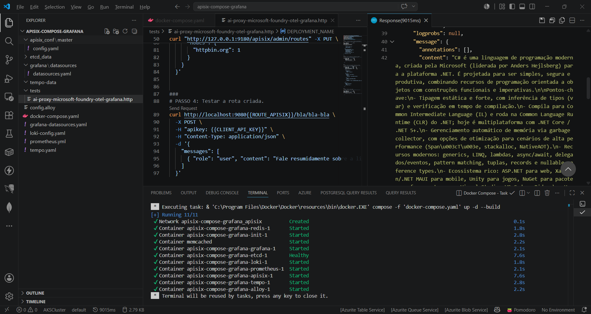
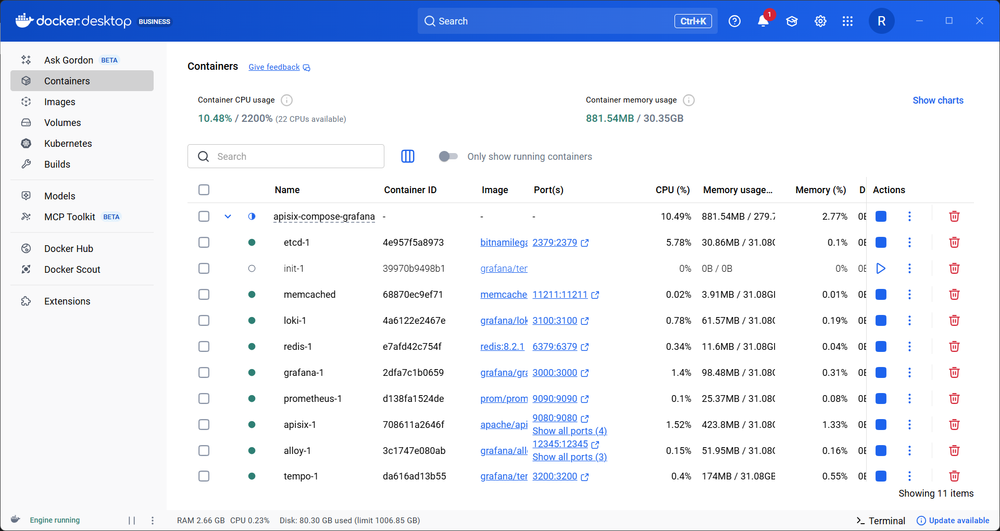
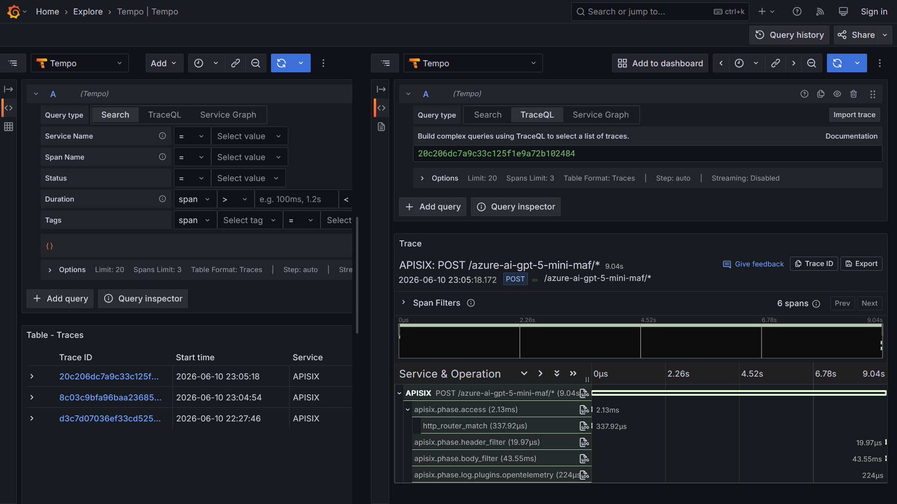
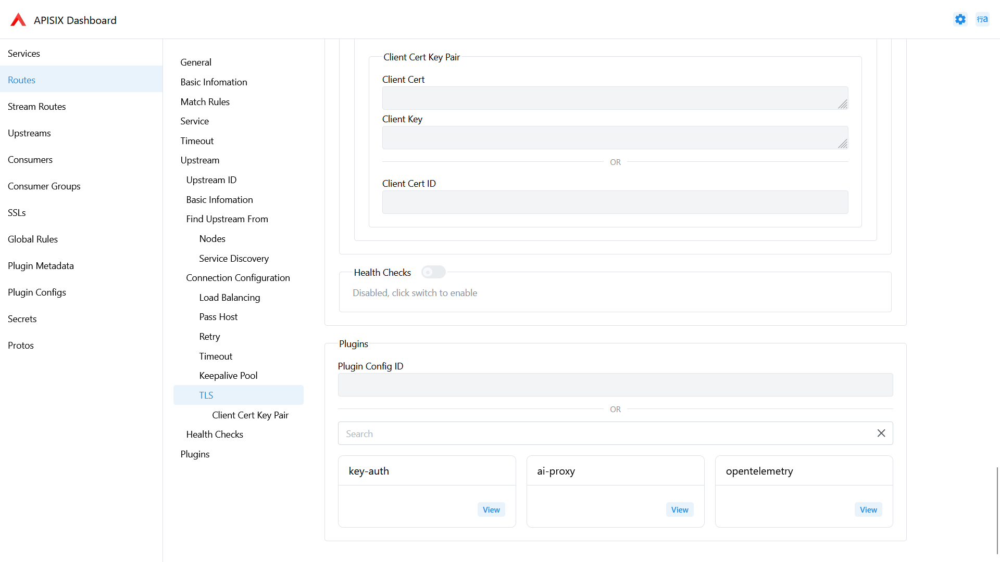

# apisix-ai-gateway-otel-grafana-dockercompose
Scripts do Docker Compose para subida de um ambiente do APISIX com capacidade de AI Gateway. Inclui monitoramento com Grafana + OpenTelemetry, com geração de traces de requisições direcionadas ao APISIX.

Containers criados (**APISIX + etcd + stack Grafana**):

Trace no Grafana Tempo:

Rota configurada no APISIX:

